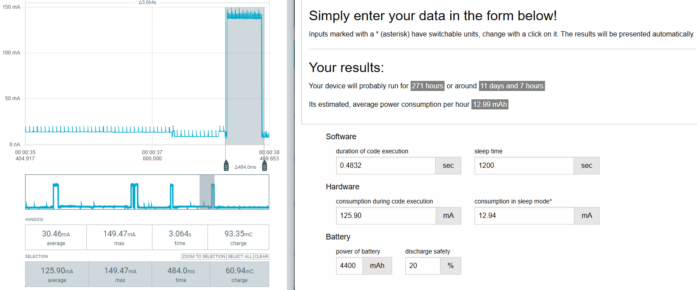
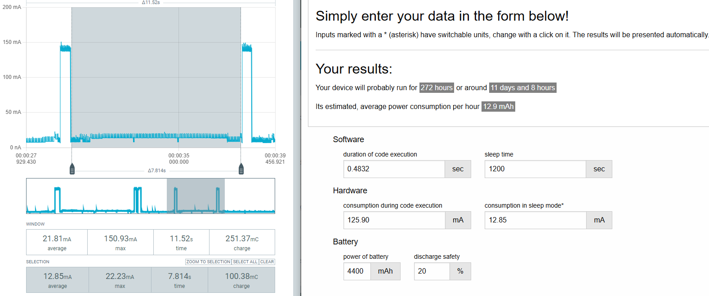

# Dieter Meshtastic

## Description

This project aims to send sensor values over the mesh network to a Wisblock Core.

## Content

- [Hardware](#hardware)
- [Meshtastic](#meshtastic)
- [Data Types](#data-types)
- [Test Report](#test-report)

## Hardware
### RawWireless WisBlock

| Component  | Price (€) | Description                                |
|------------|-----------|--------------------------------------------|
| RAK4631    | -----     | Meshtastic Starter Kit                     |
| RAK13300   | -----     | Pi-based Wisblock Core (LoRa)              |
| RAK19007   | -----     | Wisblock Base                              |
| RAK11310   | -----     | ESP based Wisblock Core (BLE)              |
| **Total**  | **00.00** |                                           |

## Documentation

For datasheets, quick guides, and detailed descriptions, visit:  
[Meshtastic](https://meshtastic.org)
## Software

## Meshtastic

Meshtastic is an open-source project that enables a decentralized mesh network using affordable LoRa modules. It allows users to communicate over long distances without the need for the internet or cellular networks.

### Technology

#### LoRa (Not LoRaWAN)
- **Long-range communication:** LoRa enables wireless data transmission over several kilometers with minimal power consumption.
- **No infrastructure required:** Unlike LoRaWAN, Meshtastic operates without centralized gateways or network providers.

#### Off-Grid Communication
- **Works without the internet or mobile networks.**
- **Ideal for remote locations, emergency situations, and outdoor adventures.**

#### 100% Open Source
- **Software and hardware are fully open-source.**
- **Community-driven development.**

#### Decentralized Network
- **No routers required.**
- **Each device acts as a node in the mesh.**
- **Messages are relayed across nodes for long-distance communication.**

#### Encryption & Security
- **AES encryption ensures secure communication.**
- **Only devices with the correct keys can read messages.**

#### Battery Life & Power Efficiency
- **Optimized for low power consumption.**
- **Long-lasting battery life depending on usage and device.**

#### Messaging
- **Send & receive messages between mesh points.**
- **No phone required for communication within the mesh.**

#### GPS-Based Functions (Optional)
- **Share location data.**
- **Track movements within the network.**

### Device Pairing & Connectivity
- **Radios can be paired with a single phone at a time.**
- **Each device is capable of connecting to only one user at a time.**
- **Supports multiple communication methods:**
  - Serial
  - Wi-Fi
  - Bluetooth Low Energy (BLE)
  - Ethernet
- **Messages are broadcasted via radio.**
- **No direct receipt confirmation, messages can be resent up to 3 times.**
- **If the receiver already has the message, it is ignored; otherwise, it is rebroadcast.**
- **Hop Limit:**
  - Default is 1.
  - If hop limit is 0, the message is not rebroadcast.
- **Each message is broadcast only once.**
- **Radio buffer holds around 30 packets; older packets are replaced by new ones.**

### Frequency Bands

#### Europe (EU)
##### 433 MHz Band
- **Effective Radiated Power:** 10 dBm
- **Frequency Range:** 433-434 MHz
- **Default Frequency (after reset):** 433.875 MHz
- **Mode:** Long Fast (4 slots)

##### 869 MHz Band
- **Effective Radiated Power:** 27 dBm
- **Frequency Range:** 869.40-869.65 MHz
- **Default Frequency (after reset):** 869.525 MHz
- **Mode:** Long Fast (1 slot)

#### Long Range Fast Mode
- **Alternative Name:** Long Fast
- **Data Rate:** 1.07 kbit/s
- **Spreading Factor:** 11
- **Symbols:** 2048
- **Coding Rate:** 4/5
- **Bandwidth:** 250 kHz
- **Link Budget:** 153 dB

### Routing Algorithm
- **Flood Routing:** Messages are broadcasted across the network.
- **Version 2 and above prefer devices that are further away for relays.**
- **Uses Protocol Buffers for data serialization.**
- **Mesh Packet & Sub Packet Types for structured data transmission.**

### LoRa Datagram Structure
- **16-byte Preamble**
- **LoRa Physical Header:**
  - Packet Length
  - Sync Word (Default for Meshtastic: `0x2B`)

#### Packet Content Structure
| Offset | Bytes | Type | Description |
|--------|-------|------|-------------|
| 0x00   | 4     | int  | Destination (unique node ID, format: `0xffffffff`, little-endian) |
| 0x04   | 4     | int  | Sender (unique node ID, format: `0xffffffff`, little-endian) |
| 0x08   | 4     | int  | Packet ID (unique identifier for each packet) |
| 0x0C   | 1     | bits | Flags (see table below) |
| 0x0D   | 1     | bits | Channel Hash (for decryption) |
| 0x0E   | 1     | byte | Next Hop (for relays) |
| 0x0F   | 1     | byte | Relay Node (current transmission) |
| 0x10   | max 237 | bytes | Packet Data (unused bytes are not transmitted) |

#### Packet Header Flags
| Index | Bits | Usage |
|--------|------|-------------|
| 0      | 3    | Hop Limit |
| 3      | 1    | Acknowledgment Request (Want ACK) |
| 4      | 1    | MQTT Transmission (Packet coming from MQTT) |
| 5      | 3    | Hop Start (Original hop limit) |

### Power Consumption Simulation

#### Code Execution Mode

**Results:**

Average power consumption during active Mode was 125.90 mA over a duration of 0.4832 seconds.
The battery life calculation considered the following parameters:

- Code execution duration: 0.4832 seconds
- Sleep time: 1200 seconds
- Consumption during code execution: 125.90 mA
- Consumption in sleep mode: 12.85 mA
- Battery capacity: 4400 mAh with 20% discharge safety margin.

#### Passive Mode

**Results:**

Average power consumption during passive Mode was 12.85 mA over a duration of 7.814 seconds. 
The battery life calculation considered the following parameters:

- Code execution duration: 0.4832 seconds
- Sleep time: 1200 seconds
- Consumption during code execution: 125.90 mA
- Consumption in sleep mode: 12.85 mA
- Battery capacity: 4400 mAh with 20% discharge safety margin.

Estimated battery life: approximately 272 hours, equivalent to around 11 days and 8 hours. 
Estimated average power consumption per hour: 12.9 mAh.

---

### Test Report 
**Date:** Wednesday, May 14th, 2025  
**Location:** Stollen, Bad Ems

#### Overview

 The tests focused on:

- **Signal reliability and failover**
- **Penetration and underground communication**
- **Mesh forwarding behavior**
- **Maximum distance between nodes**

---

#### Test Setup

All nodes were identical, based on the **RAK4631 module (model 4003)** operating at **868 MHz**.  
Transmission power was configured to **+20 dBm**, using Meshtastic’s default LoRa parameters.

### Node Roles and Locations

- **Base Node**  
  - Connected via serial to a data logger  
  - Located next to the antenna at the **Weidtmann shaft**

- **Second Node**  
  - Positioned at the **entrance of Shaft 2**

- **Third Node (Test Node)**  
  - Used for different test scenarios:
    1. Inside Shaft 2, opposite the bridge (deep tunnel area)
    2. Entrance to the tunnel on **Von Ems Street**, directly opposite the Weidtmann shaft

---

#### Test Results

##### 1. Base Test – Without Repeater

- **Goal:** Check if direct communication is possible over full range
- **Distance:** ~575 meters (mostly line-of-sight)
- **RSSI:** ~**–126 dBm**  
- **SNR:** Very low or negative

> 🔴 **Result:** Unstable communication. Rare messages received, possibly due to signal artifacts. Not reliable for data transmission.

---

##### 2. Mesh Forwarding Test – With Repeater Node

- **Repeater Node Position:** Tunnel midpoint near Shaft 2 (~361 m from base)
- **Tunnel depth at repeater location:** ~15–18 meters
- **RSSI:** **–85 to –96 dBm**  
- **SNR:** **+2 to +5 dB**

> 🟢 **Result:** Reliable message forwarding with low latency. High communication stability with acceptable signal quality.

---

### Summary

| Test Case               | Distance (m) | Repeater | RSSI (dBm)   | Result                          |
|-------------------------|--------------|----------|--------------|---------------------------------|
| Base to Tunnel Entrance | ~575         | ❌        | ~–126        | Unstable, likely false positive |
| With Repeater Node      | ~575 total   | ✅        | –85 to –96   | Stable, reliable communication  |

---

### Conclusion

- Direct LoRa communication over 575 m in this terrain is **unreliable without relaying**.
- A **single strategically placed node** significantly improves performance and reliability.
- Meshtastic is suitable for underground monitoring or sensor mesh networks with proper placement.

### Useful Links
- [Official Website](https://meshtastic.org/)
- [GitHub Repository](https://github.com/meshtastic/)

